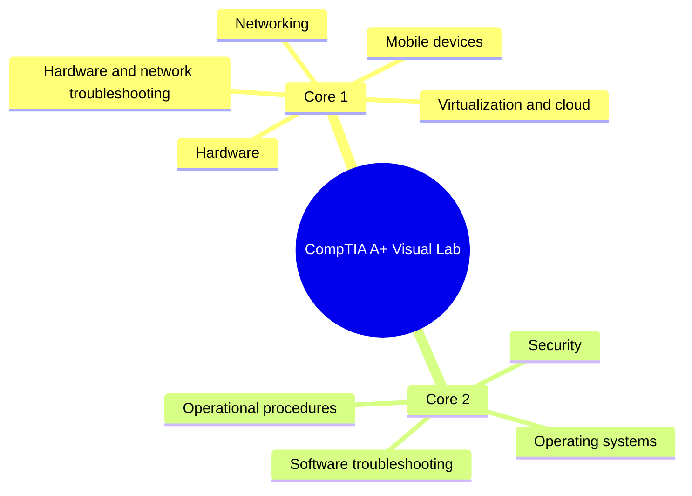

# A+ Study Map

## What

This map connects the lab stations to A+ study areas.

## Why

It helps the learner see how the labs connect instead of treating each topic as separate.

Example:

A slow laptop may involve hardware, OS settings, software troubleshooting, and operational procedures.

## How



Checklist:

- [ ] Pick one map branch.
- [ ] Match it to one lab.
- [ ] Complete one ticket.
- [ ] Record one piece of evidence.

## Implementation

Use this map during weekly review.

Weekly review example:

```text
This week:
- Hardware: completed APLUS-001
- Networking: completed APLUS-002
- Security: reviewed phishing indicators

Next week:
- OS repair and app crash scenarios
```

Checklist:

- [ ] Mark covered branches.
- [ ] Leave uncovered branches visible.
- [ ] Revisit weak areas with a new ticket.

## Assumptions

- The learner is preparing across both A+ exams.
- The map is a guide, not a replacement for official objectives.

Checklist:

- [ ] Cross-check with official objectives.
- [ ] Add topics as needed.

## Threat/Risk Notes

- Do not confuse lab confidence with exam readiness.
- Do not skip written review entirely.

Checklist:

- [ ] Practice performance-style tasks.
- [ ] Practice vocabulary recall.
- [ ] Practice explaining fixes.

## Validation Steps

- [ ] Each major branch has at least one completed ticket.
- [ ] Each completed ticket has evidence.
- [ ] Weak areas are visible on the map.

