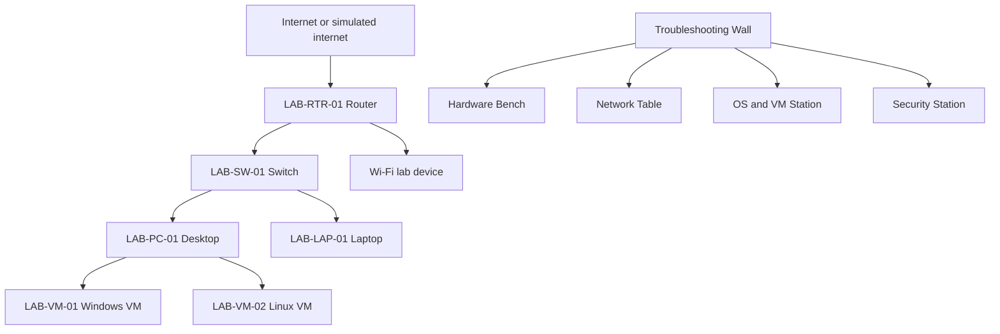

# Lab Topology

## What

This diagram shows the full visual lab.

It separates physical devices, virtual systems, and the ticket workflow.

## Why

The learner can see where a problem lives before trying to fix it.

Example:

If the ticket says "Wi-Fi connected but no websites", start at the Network Table, not the Hardware Bench.

## How

Checklist:

- [ ] Identify the affected station.
- [ ] Trace the path with a finger or pointer.
- [ ] Name the first safe check.
- [ ] Check only one thing at a time.

## Implementation

Suggested labels:

- Blue: hardware
- Yellow: networking
- Purple: operating systems
- Red: security and risk
- Green: complete

Checklist:

- [ ] Label each device.
- [ ] Keep diagrams near the matching station.
- [ ] Keep ticket cards visible.

## Assumptions

- The lab may be physical, virtual, or hybrid.
- A router simulator can replace a real router.
- VMs can replace spare computers.

Checklist:

- [ ] Pick one lab mode.
- [ ] Keep diagrams accurate to that mode.

## Threat/Risk Notes

- Do not connect unknown equipment to a shared network.
- Do not publish real network names or addresses.
- Do not practice remote access on systems you do not own.

Checklist:

- [ ] Use lab-only names.
- [ ] Use dummy IP addresses for public notes.

## Validation Steps

- [ ] Every device on the diagram has an inventory row.
- [ ] Every ticket maps to one station.
- [ ] The learner can explain the path from device to router.

