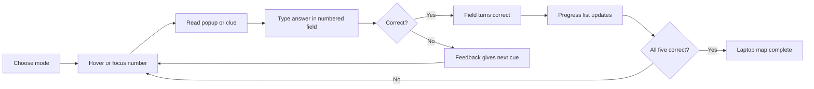

# Laptop Hardware Interaction Map

## What

This diagram describes the redesigned Laptop Hardware activity.

The learner sees the diagram first, then uses one small action at a time.

Example:

Hover `04`, learn the clue, then type `M.2 SSD` into answer field `04`.

## Why

The earlier version placed answer chips on top of the artwork.

That made the learner read too much while also trying to inspect the diagram.

The redesigned version keeps the artwork clean and moves details to hover/focus popups plus a side answer panel.

## How

Checklist:

- [x] Diagram stays visible.
- [x] Answer fields stay in the side rail.
- [x] Checked answers move to progress state, not onto the artwork.
- [x] Learn mode can show hover/focus popups.
- [x] Quiz mode can hide answer popups.
- [x] Hint and Check are separate actions.

## Implementation

- `app/index.html` defines the Laptop panel layout.
- `app/app.js` controls modes, hotspot focus, typed answers, hints, checks, and progress.
- `app/styles.css` defines the diagram-first layout, numbered hotspots, popups, and answer states.
- `assets/generated/VIS-013A-laptop-open-view-gpt-unnumbered.png` is the active open laptop view.
- `assets/generated/VIS-013B-laptop-external-ports-view-gpt-unnumbered.png` is the active external ports view.
- `assets/generated/VIS-013C-laptop-internal-view-gpt-unnumbered.png` is the active internal view.
- `assets/generated/VIS-013D-laptop-front-led-view-gpt-unnumbered.png` is the active front LED view.
- Matching numbered PNG views are saved in `assets/generated/` for future quiz artwork.

Checklist:

- [x] Use separate generated PNG views.
- [x] Keep unnumbered views active in the app.
- [x] Save numbered views as a second asset set.
- [x] Keep numbered hotspots as code-native buttons.
- [x] Keep feedback as code-native text.
- [x] Keep answer aliases and checking data in JavaScript.

## Assumptions

- The laptop is generic and not tied to one brand or model.
- Port and internal layouts can vary by make and model.
- The first five numbered parts are enough for this MVP.
- Front LEDs are included now for future troubleshooting activities.

Checklist:

- [x] Label the diagram as model-variable.
- [x] Avoid brand marks.
- [ ] Add more laptop numbers only after this interaction tests well.

## Threat/Risk Notes

Risk:

The generated artwork can look authoritative even though laptop layouts vary.

Response:

Keep the note visible and teach shape/role, not exact service procedure.

Risk:

Internal laptop work can imply the learner should open a real laptop.

Response:

Use the internal view as a recognition map unless a separate safety checklist is active.

Checklist:

- [x] Avoid unsafe repair instructions in the app panel.
- [x] Keep the internal view conceptual.
- [ ] Add a safety gate before any physical laptop disassembly lab.

## Validation Steps

- [ ] Open Laptop Hardware.
- [ ] Confirm Learn mode shows hover/focus popups.
- [ ] Confirm Quiz mode hides answer popups.
- [ ] Type one correct numbered answer.
- [ ] Type one incorrect numbered answer.
- [ ] Confirm no labels, chips, or cards cover the laptop artwork.
- [ ] Confirm Hint reveals one target.
- [ ] Confirm Check validates typed answers.
- [ ] Confirm mobile layout has no horizontal scrolling.
