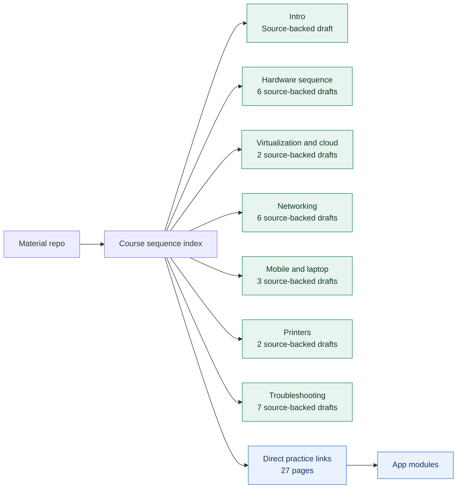

# Material Coverage Map

## What

This diagram shows the current course-sequence material status.

It is a quick builder view, not a learner lesson.

## Why

The repo now has enough pages that a plain checklist is easy to misread. A coverage map makes the remaining gaps visible without making the landing page busier.

## How



Checklist:

- [x] Show the main material groups.
- [x] Mark source-backed draft clusters.
- [x] Show direct practice-link coverage.
- [x] Update after Intro and Laptop hardware are filled.

## Implementation

Source of truth:

```text
datasets/course-sequence-map.csv
materials/course-sequence/README.md
```

Checklist:

- [x] Mirror the course-sequence dataset.
- [x] Link from the material index.
- [ ] Re-check counts after each material-writing pass.

## Assumptions

- Source-backed draft pages still need final exam-objective validation.
- Direct practice links point to the nearest current app module.
- Some topics still need richer diagrams or dedicated labs.

Checklist:

- [x] Separate "has sources" from "complete".
- [x] Keep source-backed pages labeled as drafts.
- [x] Close true placeholder gaps.
- [ ] Add objective-level status later.

## Threat/Risk Notes

Risk:

The learner or portfolio reviewer could read the map as final coverage.

Response:

Use draft language until objective validation and learner testing are complete.

Checklist:

- [x] Use "draft" status labels.
- [ ] Add final validation notes before publication.

## Validation Steps

- [x] Count source-backed draft groups against the material index.
- [x] Confirm no true placeholders remain.
- [ ] Re-run the status check after the next writing pass.
