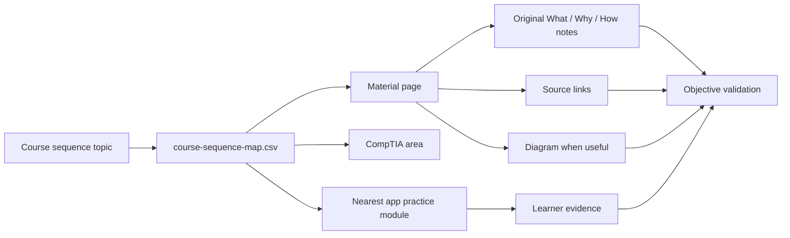

# Material Repo Flow

## What

This diagram shows how the course sequence, material pages, app practice modules, and validation checks connect.

## Why

The Start Map should stay light. The material repo holds the longer explanations, source links, and diagrams that would make the app feel crowded.

## How



Checklist:

- [x] Map each topic to a material page.
- [x] Map each topic to a CompTIA area.
- [x] Map each topic to the nearest current app module.
- [x] Track source-backed draft status.
- [x] Add direct practice links to material pages.
- [ ] Add objective-level validation status.

## Implementation

The reusable data source is:

```text
datasets/course-sequence-map.csv
```

The learner-facing pages live in:

```text
materials/course-sequence/
```

Checklist:

- [x] Dataset exists.
- [x] Material pages exist.
- [x] App Read links point at material pages.
- [x] Add direct practice links inside each material page.

## Assumptions

- Course-provider order is used as a study route, not as copied lesson content.
- CompTIA domains remain the exam-alignment structure.
- Some topics map to starter labs until dedicated activities exist.

Checklist:

- [x] Separate sequence mapping from learning content.
- [x] Mark drafts clearly.
- [ ] Add objective-level mapping after source review.

## Threat/Risk Notes

Risk:

Course-order mapping could be mistaken for copied course material.

Response:

Keep the mapping metadata separate from lesson text. Write all material in original wording from authoritative sources.

Risk:

Source-backed drafts could be mistaken for final exam coverage.

Response:

Keep validation tasks visible until each page is checked against current CompTIA objectives.

Checklist:

- [x] Avoid copied lesson content.
- [x] Mark material status clearly.
- [x] Keep citations with learner notes.
- [ ] Add public non-affiliation wording before release.

## Validation Steps

- [x] Open Course Sequence mode.
- [x] Confirm Read links exist.
- [x] Confirm Practice actions still map to app modules.
- [x] Confirm the dataset status no longer marks filled pages as placeholders.
- [ ] Validate each topic against official objectives.
