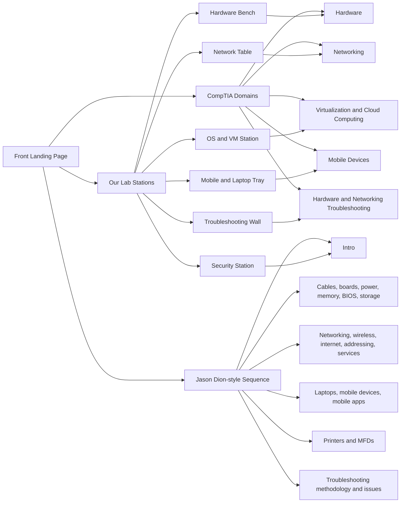

# Section Mode Map

## What

This diagram maps three ways to enter the A+ visual lab:

- our lab-station structure
- CompTIA domain structure
- Jason Dion-style study sequence structure

## Why

Different learners may need different routes into the same material.

Example:

One day the learner may start with a physical station like "Hardware Bench."

Another day they may start with a domain like "Networking."

## How

Use this as the first planning diagram for the future landing page.



Checklist:

- [x] Map has a landing page node.
- [x] Map includes current lab stations.
- [x] Map includes CompTIA domain names.
- [x] Map includes the requested Dion-style sequence groups.
- [x] Turn this into a clickable app page.
- [x] Show the course sequence as a side panel in Course Sequence mode.
- [x] Let course sequence modules highlight matching route cards.
- [x] Let course sequence modules open the nearest matched activity.
- [x] Show a Course Focus panel after a course module opens an activity.
- [x] Add a dedicated Laptop Hardware module for the mobile and laptop sequence.

## Implementation

The reusable data source is:

```text
datasets/section-map.csv
```

Checklist:

- [x] Dataset exists.
- [x] Diagram exists.
- [x] Landing page UI exists.

## Assumptions

- The landing page should reduce confusion, not add another long reading page.
- Topic lists should be grouped visually.
- The map should show current gaps.

Checklist:

- [x] Use grouped topics.
- [x] Add icons and visual thumbnails.
- [x] Add route links.

## Threat/Risk Notes

Risk:

The map could imply official affiliation or complete exam coverage.

Response:

Label it as a study navigation map and verify domain names before public release.

Checklist:

- [ ] Add "not official" wording before publication.
- [ ] Verify official CompTIA domain names before publication.
- [ ] Keep course-provider references descriptive and respectful.

## Validation Steps

- [x] Each visible tile links to a real activity or "not built yet" state.
- [x] The map works on mobile.
- [ ] The learner can choose one route quickly.
