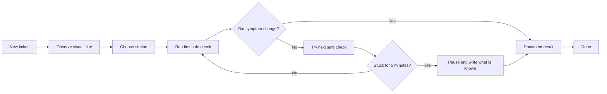
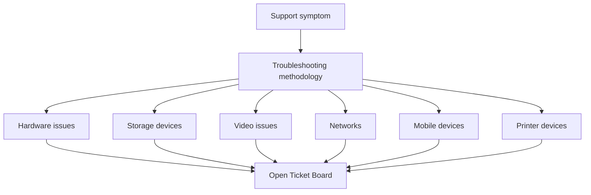

# Troubleshooting Flow

## What

This is the repeatable troubleshooting path for every ticket.

## Why

Troubleshooting is easier when the process stays the same, even when the symptoms change.

Example:

The same flow works for no display, no internet, and app crashes.

## How



Checklist:

- [ ] Observe before changing.
- [ ] Pick one station.
- [ ] Run one check.
- [ ] Record the result.
- [ ] Escalate by explaining, not guessing.

## Page Map

Use this map when the learner knows the symptom category but does not know which material page to open.



Checklist:

- [x] One general method page anchors the branch.
- [x] Each symptom family has a material page.
- [x] Every troubleshooting topic maps to the ticket board practice module.
- [ ] Add direct page links inside the app wiki reader later.

## Implementation

Ticket board columns:

```text
New -> Diagnose -> Fixing -> Document -> Done
```

Use a physical board, sticky notes, a Markdown table, or a task app.

Checklist:

- [ ] Move the card after each stage.
- [ ] Do not skip Document.
- [ ] Stop when the ticket reaches Done.

## Assumptions

- The learner may need a visible stop rule.
- One visible process is better than many hidden methods.

Checklist:

- [ ] Use the same process for every ticket.
- [ ] Keep the flow printed or open.

## Threat/Risk Notes

- Random changes can create new problems.
- Escalation is safer than guessing.
- Documentation protects the next technician.

Checklist:

- [ ] Avoid changing multiple settings.
- [ ] Note each change.
- [ ] Undo lab changes when needed.

## Validation Steps

- [ ] Each completed ticket has a result note.
- [ ] Each unresolved ticket has a clear next step.
- [ ] The learner can explain what was checked.
