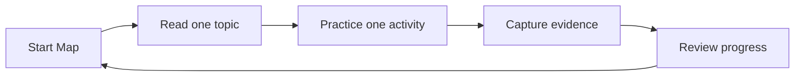

# Intro

## What

This page is the front door to the A+ Visual Lab course-sequence wiki.

The course path is a reading route, not a replacement for hands-on practice. Each topic gives the learner a short explanation, a few support clues, source links, and a nearby app activity.

## Why

A+ study can feel wide: hardware, mobile devices, networking, virtualization, cloud, troubleshooting, operating systems, security, and procedures all appear across the two exams. This project keeps the first pass calmer by letting the learner choose one topic, read a short page, then practice one visible task.

## How

Use this rhythm:

1. Pick one course topic.
2. Read the short wiki page.
3. Open the matching practice module.
4. Capture one sentence of evidence.
5. Move on or stop before overload.

Practice

- [Open Match Safe Checks](../../app/index.html#module=symptoms)
- [Open Start Map](../../app/index.html#module=start)

Sources:

- [CompTIA A+ Core 1 and 2 V15](https://www.comptia.org/en-us/certifications/a/core-1-and-2-v15/)
- [CompTIA A+ 220-1201 exam objectives PDF](https://partners.comptia.org/docs/default-source/resources/comptia-a-220-1201-exam-objectives-%282-0%29.pdf)

Checklist:

- [x] Explain the purpose of the material repo.
- [x] Keep the learner path short.
- [x] Link the relevant app modules.
- [x] Add a simple topic overview diagram.
