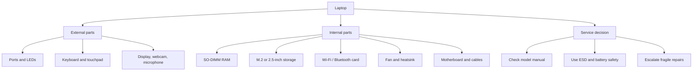

# Laptop Hardware

What

Laptop hardware is the set of parts packed into a portable computer: display, keyboard, touchpad, ports, battery, storage, memory, cooling, wireless card, and system board. The support goal is to identify the part, understand what it does, and avoid treating a laptop like an easy-open desktop.

Why

Laptops are compact, fragile, and model-specific. A learner should recognize the visible parts first, then understand which internal parts are common service points and which ones usually need a manual, warranty process, or experienced technician.

How

Read the laptop in layers:

1. Outside: ports, webcam, keyboard, touchpad, display, speakers, LEDs, charger.
2. Access panels: storage, memory, battery, wireless card, where the model allows it.
3. Internal view: cooling fan, heatsink, motherboard, ribbon cables, antennas.
4. Service decision: reseat, replace, update, document, or escalate.

Useful support clues:

- USB-C can carry power, data, display, or docking, but the exact features depend on the model.
- SO-DIMM RAM is the small laptop memory format when memory is not soldered.
- M.2 SSDs are small storage cards mounted directly to the motherboard.
- Wi-Fi and Bluetooth may share a small wireless card and antenna leads.
- Display, keyboard, and touchpad repairs often involve ribbon cables and model-specific steps.

Practice

- [Open Laptop Hardware](../../app/index.html#module=laptop)

Sources:

- [CompTIA A+ Core 1 and 2 V15](https://www.comptia.org/en-us/certifications/a/core-1-and-2-v15/)
- [Dell: A Basic Guide to Identifying the Main Parts of a Laptop](https://www.dell.com/support/kbdoc/en-us/000139511/a-basic-guide-to-identifying-the-major-components-of-a-laptop-system)
- [HP Support: Components](https://support.hp.com/us-en/document/ish_6508673-6356388-16)

Checklist:

- [x] Define common laptop external parts.
- [x] Define common laptop internal parts.
- [x] Separate identification from service decision.
- [x] Link the laptop hardware app module.
