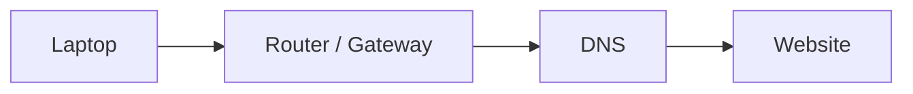

# Topology Evidence

## What

This diagram shows the path used for the networking ticket.



## Why

The learner can see that a web request has more than one step.

If one step fails, the browser may fail even when Wi-Fi looks connected.

## How

Use the path as a tap-and-say check:

```text
Laptop -> Router -> DNS -> Website
```

Checklist:

- [x] Start at the learner device.
- [x] Move to the gateway.
- [x] Check name lookup.
- [x] End at the website.

## Implementation

The current app has a Topology Trace module that uses this same order.

This evidence file records the intended path after completion.

## Assumptions

- The route is simplified for beginner practice.
- The diagram does not show every real network hop.
- DNS is represented as a learning checkpoint.

Checklist:

- [x] Keep diagram simple.
- [x] Avoid real network identifiers.
- [x] Use the same path language as the app.

## Threat/Risk Notes

Risk:

A real topology diagram can reveal network layout.

Response:

Use simplified diagrams for portfolio evidence unless the network is fully fictional.

Checklist:

- [x] No real router name.
- [x] No real IP address.
- [x] No real device owner.

## Validation Steps

- [x] Diagram matches the ticket.
- [x] Diagram matches the app topology order.
- [x] Diagram is safe to share.
